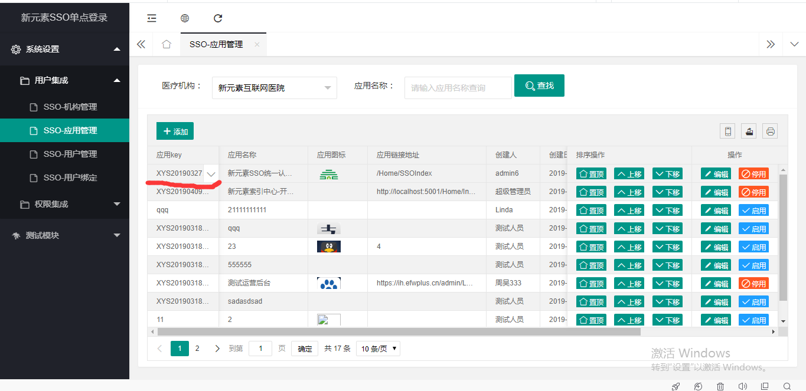
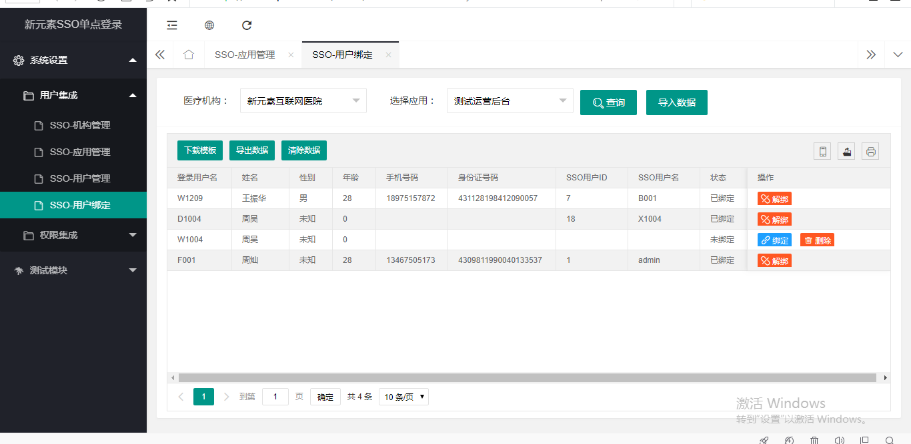
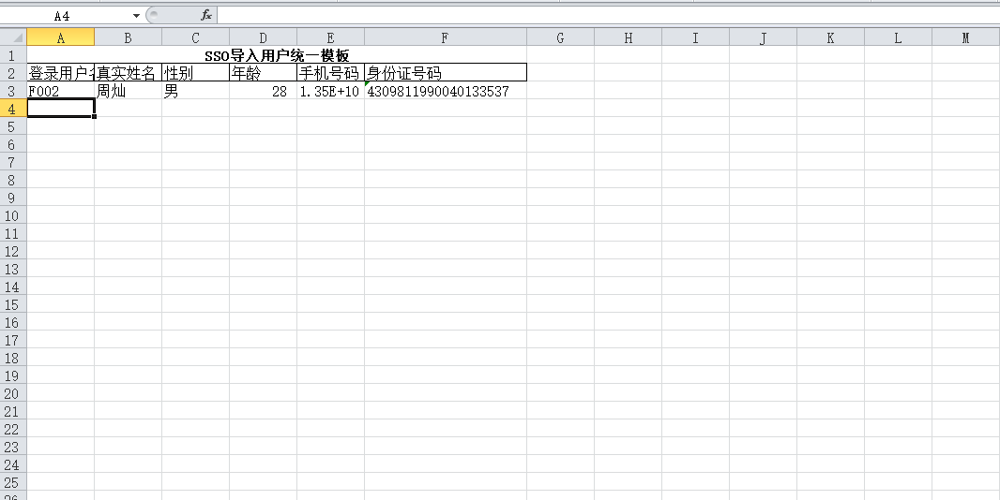
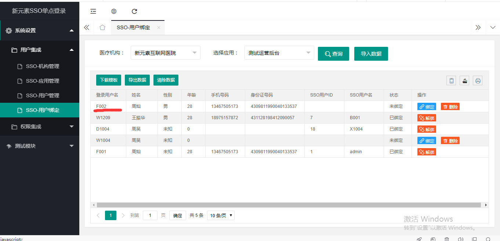
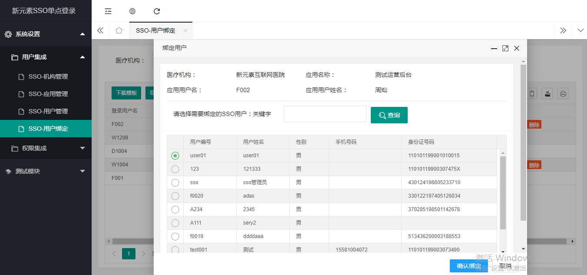
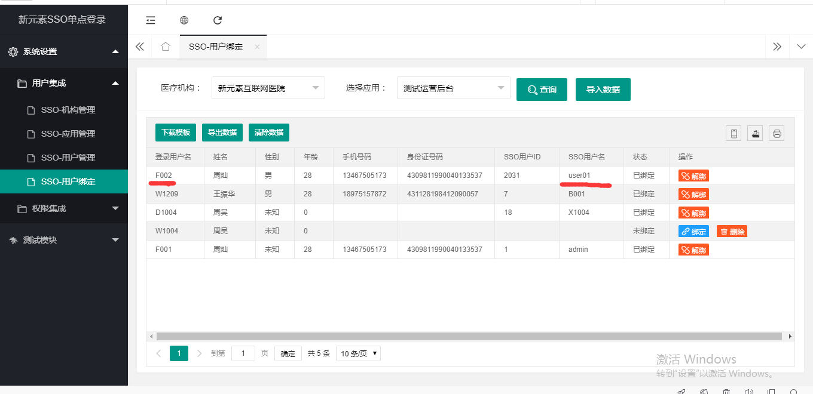
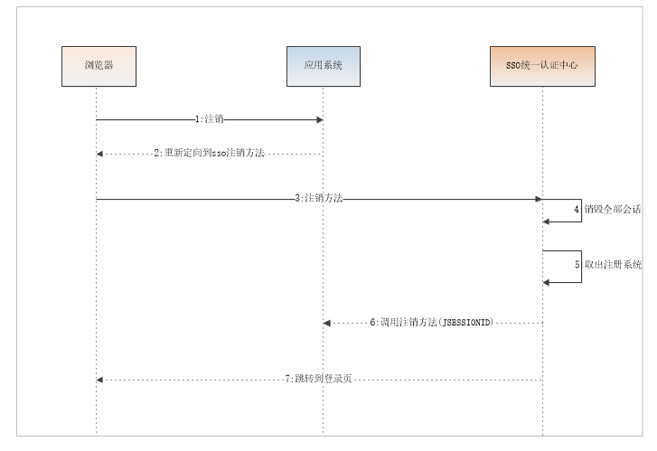
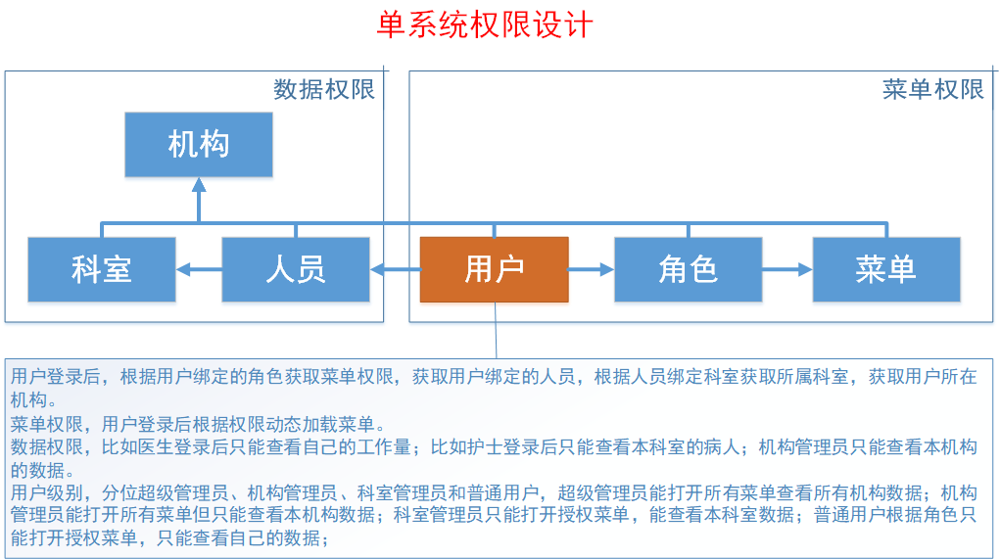
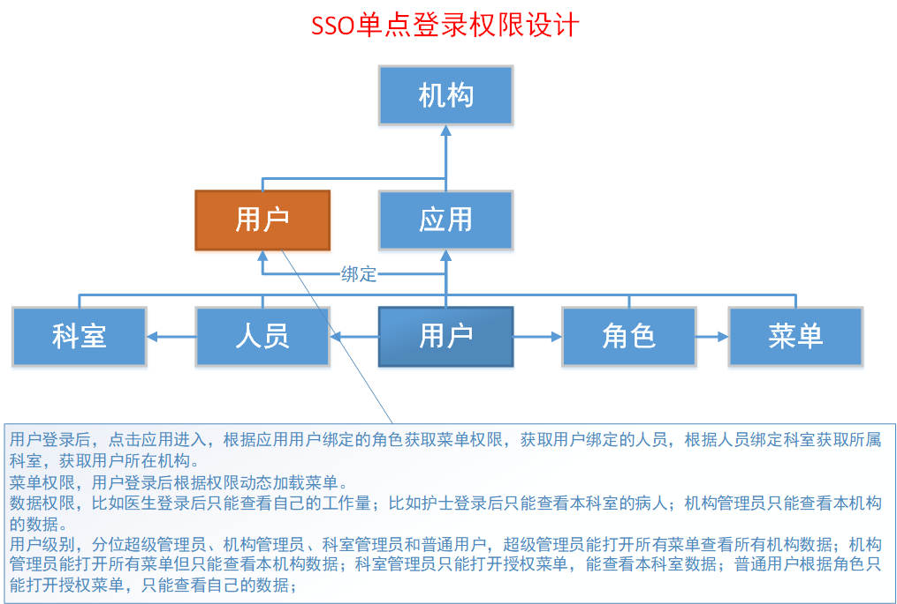

# SSO单点登录
## 操作手册
### Sso中心平台地址:https://sso.efwplus.cn:8888/Login/Index
### 一、	创建应用(获取Appkey)

### 二、	用户绑定(绑定应用用户)
#### 1、进入用户绑定页面

#### 2、下载模板

#### 3、导入数据

#### 4、绑定用户

## 对接文档
### 一、登录流程

### 二、注销流程

### 三、接口接入
|登录接入||||
|:---|:---|:---|:---|
|请求地址|https://sso.efwplus.cn:8888/Authorize/Index|||
|请求方式|重定向跳转|||
|参数|是否必填|类型|备注|
|jSessionID|是|String|登录凭证|
|returnUrl|是|String|回传地址|
|logOut|是|String|登出接口地址|
|appKey|是|String|第三方应用惟一标识(暂时由sso中心平台分配)|
|结果|重定向到sso认证页 Ps:中心平台有登录凭证并且跳转到returnUrl?ssotoken=xxx||||

|Token验证||||
|:---|:---|:---|:---|
|请求地址|http://192.168.199.78:7777/sso/v1/Authorize/CheckToken|||
|请求方式|post|||
|参数|是否必填|类型|备注|
|jSessionID|是|String|登录凭证|
|Ssotoken|是|String|中心平台生成ssotoken|
|logOut|是|String|登出接口地址|
|appKey|是|String|第三方应用惟一标识(暂时由sso中心平台分配)|
|返回值|{code:0,msg:””,data:[{ appUserName:xxxx}]}|||
||Ps:code为0代表成功 其他为失败   appUserName为应用系统用户名||||

|注销接入||
|:---|:---|
|请求地址|https://sso.efwplus.cn:8888/Logout/Index|
|请求方式|重定向跳转|
|结果|重定向到sso登录页|
## 单系统权限设计

## SSO单点登录权限设计

## SSO单点登录业务流程 测试测试
