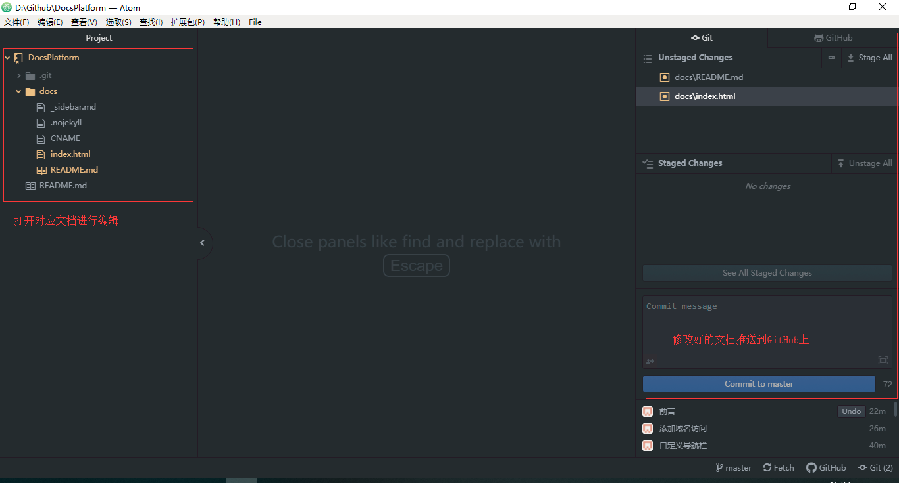

# 使用Docsify协助编写技术文档

互联网医院团队的所有技术文档都将采用Docsify进行编写，比如IH_BasicPlatform开发框架、SSO单点登录接入文档等，那就意味着所有人员都必须掌握Docsify这个工具编写文档，下面就是入门教程教大家怎么编写技术文档。

Docsify官方资料： https://docsify.js.org/#/zh-cn/ 。

互联网医院技术文档： https://docs.efwplus.cn

## 准备工作

- 注册github账号，然后将账号发给曾浩加入文档编辑权限。github： https://github.com/
- 安装Git工具，用来克隆GitHub上的文档库。
- 安装Atom工具，用来编辑MD文档的工具。

## 克隆文档库

执行下面命令

```bash
git clone https://github.com/Internethospital/DocsPlatform.git
```

## Atom编写文档

使用Atom打开克隆下来的DocsPlatform文件夹，左边为文档目录，中间文档编辑区域，右边为提交文档到服务器。



修改Atom的语言为中文： https://atom.io/packages/simplified-chinese-menu
