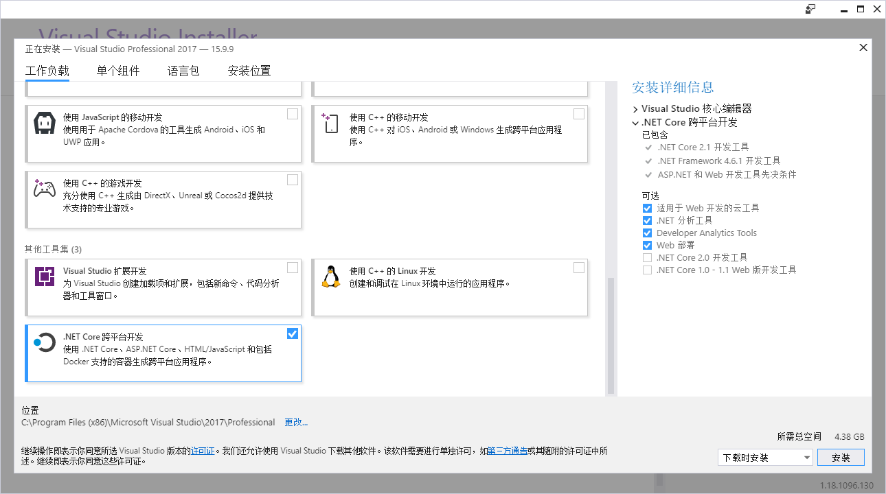
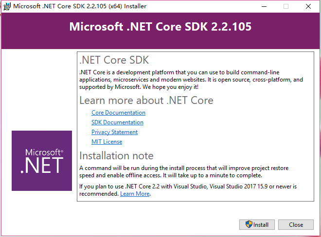
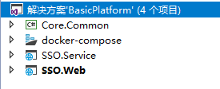
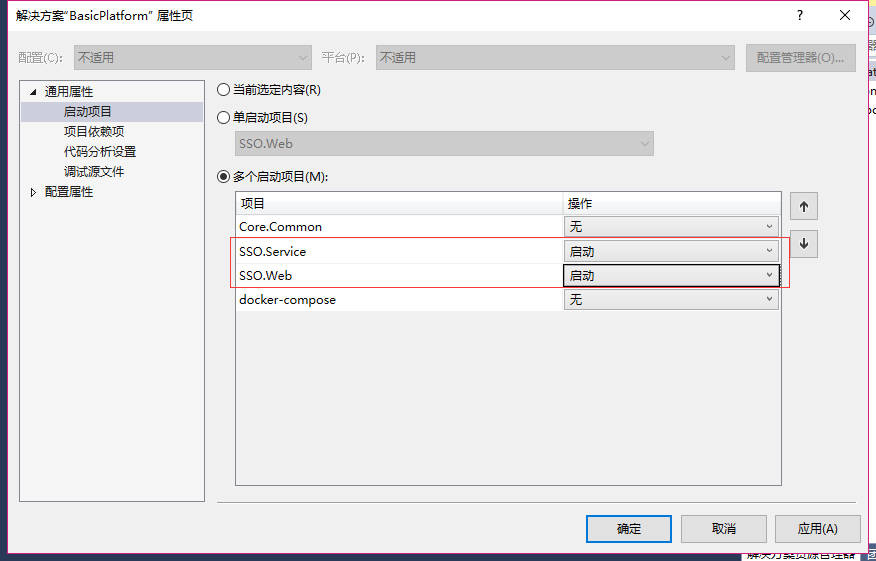
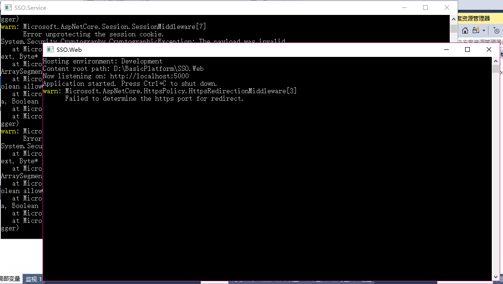
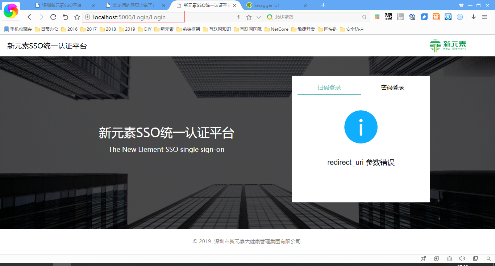
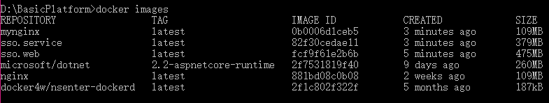
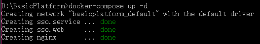
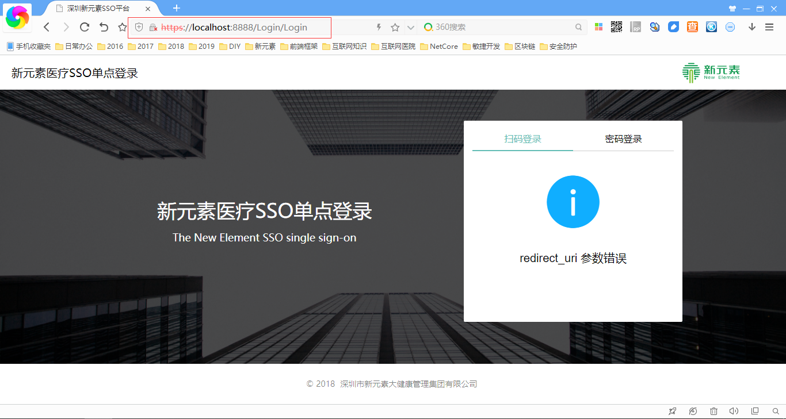

# 起步

## 工具安装

- 安装Visual Studio Community 2017

只需要勾选.Net Core进行安装



- 安装 .Net Core 2.2



- 安装SQLServer2012
- 安装Docker for Windows

## 下载框架源代码&还原数据库

- 1、从GitHub上下载框架源代码

```bash
git clone https://github.com/Internethospital/BasicPlatform.git
```

- 2、还原目录BasicPlatform\database\basicplatform.bak数据库


- 3、修改连接数据库配置文件BasicPlatform\SSO.Service\appsettings.json

```json
{
  "ConnectionStrings": {
    "DefaultConnection": "server=.;database=basicplatform;uid=sa;pwd=1;",
    "MySqlConnection": "server=47.74.150.87;database=familydb;uid=root;pwd=boluo;",
    "RedisConnection": "127.0.0.1:6379"
  },
  "Logging": {
    "LogLevel": {
      "Default": "Warning"
    }
  },
  "AllowedHosts": "*",
  "JwtAuthorize": {
    "Secret": "ABCDEFGHIJKLMNOPQRSTUVWXYZ1234567890",
    "Issuer": "szxys",
    "Audience": "everyone",
    "PolicyName": "permission",
    "DefaultScheme": "Bearer",
    "IsHttps": false,
    "RequireExpirationTime": true,
    "Expiration": 50000
  }
}
```

## 用Visual Studio Community 2017打开源代码编译运行

- 1、打开解决方案BasicPlatform.sln



- 2、右键解决方案》设置启动项目 为多个启动项目



- 3、启动程序




## 在Docker下运行

- 1、用dotnet命令编译源代码并发布
```bash
dotnet restore "D:/BasicPlatform/SSO.Web/SSO.Web.csproj"
dotnet restore "D:/BasicPlatform/SSO.Service/SSO.Service.csproj"
dotnet build "D:/BasicPlatform/SSO.Web/SSO.Web.csproj"
dotnet build "D:/BasicPlatform/SSO.Service/SSO.Service.csproj"
dotnet publish "D:/BasicPlatform/SSO.Web/SSO.Web.csproj" -o "D:/BasicPlatform/SSO.Web/publish"
dotnet publish "D:/BasicPlatform/SSO.Service/SSO.Service.csproj" -o "D:/BasicPlatform/SSO.Service/publish"
```
- 2、用docker命令编译容器并启动
```bash
docker-compose down --rmi all
docker-compose build
docker-compose up -d
```
> docker编译后查看镜像



> docker启动镜像



> 浏览器访问系统


